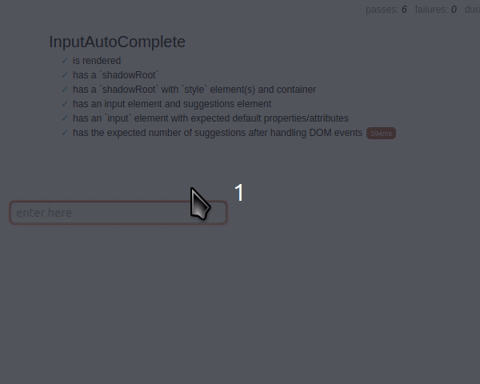

# `@songhay/input-autocomplete`

## an HTML input element with auto-complete functionality

Here is a sample declaration of this Web Component from the `mocha` [test harness](./__tests__/index.html):

```html
<rx-input-autocomplete
    inputId="my-input"
    cssSuggestionAlignment="left"
    cssSuggestionSelectedContainer="border: solid red;"
    cssSuggestionSelectedCommand="font-weight: bold;"
    cssWidth="16em"
    placeholder="enter here">
</rx-input-autocomplete>
```



📚 `typedoc` [documentation](https://bryanwilhite.github.io/songhay-web-components/input-autocomplete/) is available.

@[BryanWilhite](https://twitter.com/BryanWilhite)
