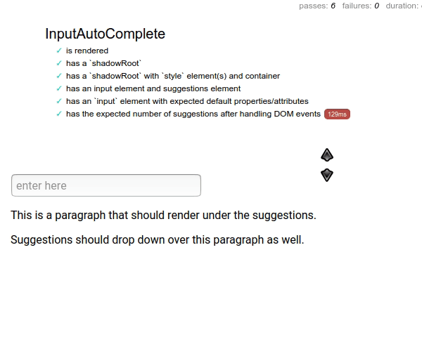

# `@songhay/input-autocomplete`

## an HTML input element with auto-complete functionality

📚 `typedoc` [documentation](https://bryanwilhite.github.io/songhay-web-components/input-autocomplete/) is available.

@[BryanWilhite](https://twitter.com/BryanWilhite)
